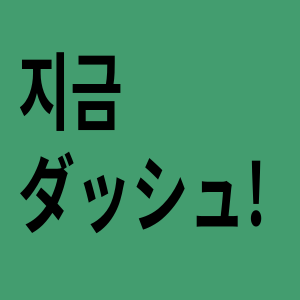

<h1 align="center">
    
     
    
JiGeum Dash!

</h1>

# 简介

## JiGeum Dash

又一个音游。仿Muse Dash。

自己写着玩的，轻喷。

游戏核心接受命令行参数，指定本次运行的曲谱和素材文件。在解压后的配置文件中指定更多参数。

由于以raylib为基础，因此本项目是跨平台的。

示例音乐作者：bilibili@鼻血黄豆(UID: 20002123)。（感谢UP授权！）

## PDL (Plain Dash Launcher)

游戏前端。有两个功能：

- 对命令行的包装，即允许在GUI中指定曲谱和素材，并一键运行。

- 管理本地的曲谱和素材文件。

（其实就是Minecraft和MC启动器的关系）

本项目应当是platform specific的。

## JDE (JiGeum Dash Editor)

游戏曲谱和素材编辑器。

在素材方面，可以很方便的对角色、小怪、BOSS等美术素材统一打包。